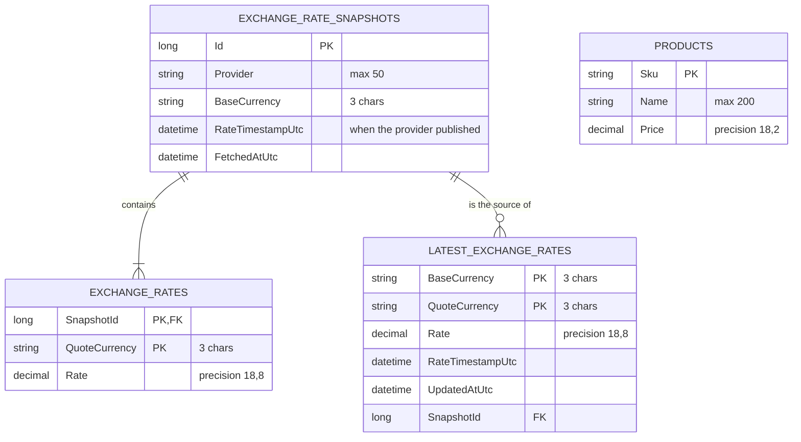

# Data Model

Four application tables in one SQLite database, created by EF Core migrations (`src/Demo.Infrastructure/Persistence/Migrations`). Hangfire keeps its data in memory, not in this database.



| Table | Role | Rules |
|---|---|---|
| `Products` | The catalog. Prices are in the base currency (USD). | SKU and name required, price ≥ 0 (enforced by `Product`) |
| `ExchangeRateSnapshots` | One row per stored publication: the history header | **Unique (`Provider`, `BaseCurrency`, `RateTimestampUtc`)**, so a repeated or retried sync stores nothing new |
| `ExchangeRates` | One row per currency per snapshot: the history, append-only | Rate > 0, ISO 4217 codes (enforced by `ExchangeRate`) |
| `LatestExchangeRates` | One row per currency pair: what the catalog reads | Updated in the same transaction as the history; only moves forward in time (`LatestExchangeRate.UpdateFrom`) |

**Types in SQLite.** SQLite stores `decimal` and `DateTime` as TEXT. The precision is declared with `HasPrecision`, which is provider-neutral, so a migration for another database gets proper decimal columns. Timestamps are stored as UTC `DateTime` values.

## Sample records

After two weekly syncs, on Monday 21 and Monday 28 September 2026. The rates are illustrative, not real market data.

**Products** (seeded at startup when the table is empty)

| Sku | Name | Price |
|---|---|---|
| SKU1 | Classic Leather Jacket | 103.30 |
| SKU2 | Wool Overcoat | 102.20 |
| SKU3 | Canvas Sneakers | 59.99 |

**ExchangeRateSnapshots**

| Id | Provider | BaseCurrency | RateTimestampUtc | FetchedAtUtc |
|---|---|---|---|---|
| 1 | OpenExchangeRates | USD | 2026-09-21 05:00:00 | 2026-09-21 06:00:04 |
| 2 | OpenExchangeRates | USD | 2026-09-28 05:00:00 | 2026-09-28 06:00:03 |

**ExchangeRates** (history)

| SnapshotId | QuoteCurrency | Rate |
|---|---|---|
| 1 | CAD | 1.38520000 |
| 1 | CHF | 0.86230000 |
| 1 | EUR | 0.91840000 |
| 1 | GBP | 0.78910000 |
| 2 | CAD | 1.38160000 |
| 2 | CHF | 0.86410000 |
| 2 | EUR | 0.92010000 |
| 2 | GBP | 0.79050000 |

**LatestExchangeRates**

| BaseCurrency | QuoteCurrency | Rate | RateTimestampUtc | UpdatedAtUtc | SnapshotId |
|---|---|---|---|---|---|
| USD | CAD | 1.38160000 | 2026-09-28 05:00:00 | 2026-09-28 06:00:03 | 2 |
| USD | CHF | 0.86410000 | 2026-09-28 05:00:00 | 2026-09-28 06:00:03 | 2 |
| USD | EUR | 0.92010000 | 2026-09-28 05:00:00 | 2026-09-28 06:00:03 | 2 |
| USD | GBP | 0.79050000 | 2026-09-28 05:00:00 | 2026-09-28 06:00:03 | 2 |

**`GET /api/products?currency=EUR`** with these records:

| Sku | Calculation | Price |
|---|---|---|
| SKU1 | 103.30 × 0.9201 = 95.04633 | **95.05 EUR** |
| SKU2 | 102.20 × 0.9201 = 94.03422 | **94.03 EUR** |
| SKU3 | 59.99 × 0.9201 = 55.196799 | **55.20 EUR** |

**Idempotency in practice.** If the 28 September job is retried, the provider returns the same publication time. The unique key already holds it, so nothing is inserted and the latest rates stay as they are. Snapshot 1 stays in the history after snapshot 2 replaces it in the latest table.

## Inspecting the database

The file is `src/Demo.Api/demo.db` when the app is started with `dotnet run` from `src/Demo.Api`. Any SQLite client works, for example DB Browser for SQLite, or the `sqlite3` CLI built into macOS:

```bash
sqlite3 -header -column src/Demo.Api/demo.db "SELECT * FROM LatestExchangeRates;"
```
