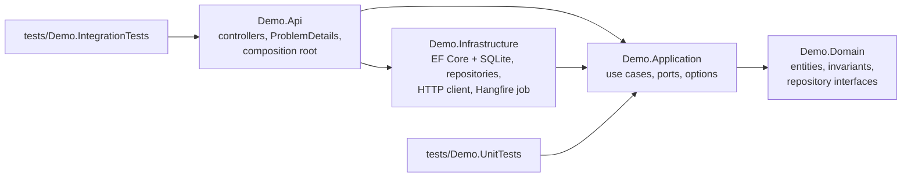
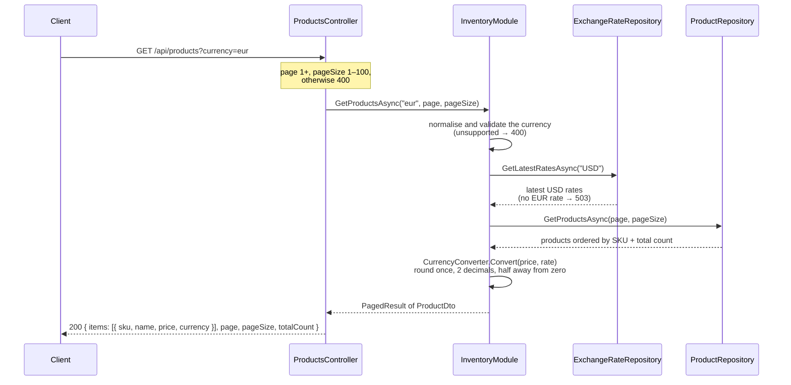
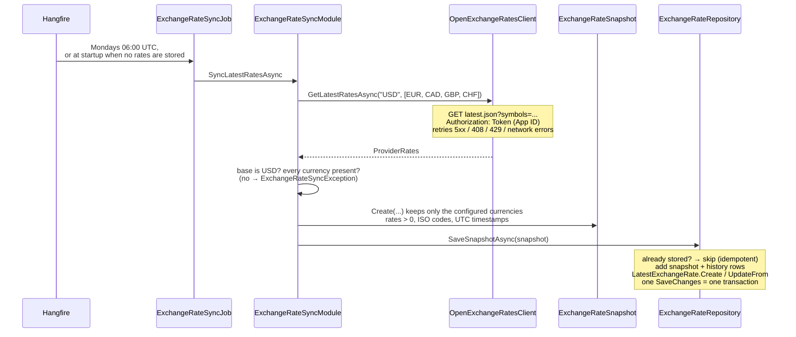

# Architecture Overview

A layered monolith following Clean Architecture, with two business capabilities: the **product catalog** (listing products, with prices converted to a requested currency) and **exchange rates** (a weekly sync from Open Exchange Rates, with history). Both capabilities share the layers and one database.

## Projects and dependencies

Dependencies point inwards: Domain depends on nothing, and Application only on Domain. Infrastructure implements the interfaces defined in Domain (repositories) and Application (`IExchangeRateProvider`). It references Application because the Hangfire job calls an Application use case. `Program.cs` only composes the layers with `AddApplication()` and `AddInfrastructure()` and configures the HTTP pipeline.

| Layer | Main types |
|---|---|
| **Domain** | `Product`, `ExchangeRateSnapshot`, `ExchangeRate`, `LatestExchangeRate`, `DomainException`, `CurrencyCodes`, `IProductRepository`, `IExchangeRateRepository`, `PagedResult<T>` |
| **Application** | `InventoryModule` (catalog queries and conversion), `ExchangeRateSyncModule` (sync use case), `CurrencyConverter`, `IExchangeRateProvider` and `ProviderRates`, `CurrencyOptions`, `ProductDto`, application exceptions |
| **Infrastructure** | `DemoDbContext` and migrations, `ProductRepository`, `ExchangeRateRepository`, `OpenExchangeRatesClient`, `ExchangeRateSyncJob`, Hangfire setup |
| **Api** | `ProductsController`, `ApiExceptionHandler` |

**Lifetimes:** repositories, modules and the job are Scoped, matching the `DbContext` (one per HTTP request or Hangfire job). The stateless message publisher is a Singleton. The typed `HttpClient` is Transient by design of `IHttpClientFactory`.

## Configuration

All settings are in `src/Demo.Api/appsettings.json`, bound to typed options and validated at startup. Any value can be overridden with an environment variable, using `__` in place of `:`.

| Section | Settings | Notes |
|---|---|---|
| `ConnectionStrings:DemoDb` | `Data Source=demo.db` | Relative to the folder the app is started from |
| `Currency` | `BaseCurrency` = `USD`, `SupportedCurrencies` = `EUR, CAD, GBP, CHF` | 3-letter uppercase codes; the base must not be in the list |
| `OpenExchangeRates` | `BaseUrl`, `AppId`, `TimeoutSeconds` = 10 | `AppId` is a secret: user-secrets locally, environment variables in production. Without it the API runs and conversions return 503. |
| `ExchangeRateSync` | `Cron` = `0 6 * * 1`, `SyncOnStartupWhenMissing` = `true` | The cron is evaluated in UTC (Mondays 06:00) |

## Catalog request

`GET /api/products?currency=EUR&page=1&pageSize=50`

Without a currency, or with `USD`, prices are returned as stored and no rate is read. Errors become `application/problem+json` responses: the `ApiExceptionHandler` maps `UnsupportedCurrencyException` to 400 and `ExchangeRateUnavailableException` to 503, MVC returns 400 for invalid paging and 404 for an unknown SKU, and anything else becomes a generic 500 that is logged.

## Exchange-rate sync

**Failures.** A failure that retrying will not fix is an `ExchangeRateSyncException`: no or rejected API key (4xx), an unexpected base, a missing currency, or a rate that breaks a domain invariant. The job logs it and fails immediately, without retries. Transient failures (network errors, 5xx, 408, 429) are first retried by the HTTP resilience pipeline. If they still fail, Hangfire retries the job up to 3 times. `DisableConcurrentExecution` prevents two syncs from running at once.

**Schedule.** The recurring job is registered again on every startup, so it survives restarts even though Hangfire storage is in memory. Job history does not survive a restart.

## What is not covered here

Running more than one instance and a configurable base currency are not implemented. See "Not done yet" in [Task1_CodeAnalysis.md](../../Task1_CodeAnalysis.md).
